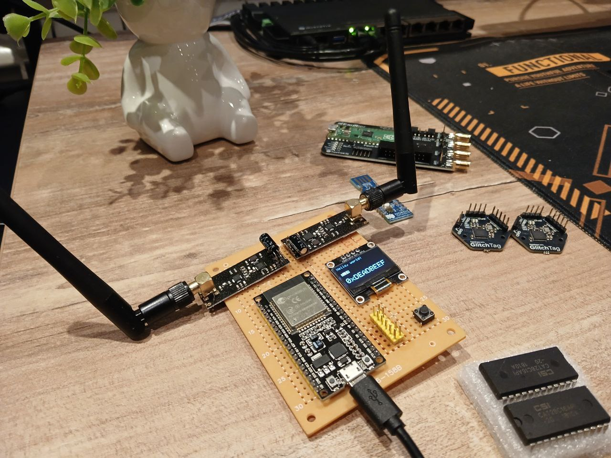
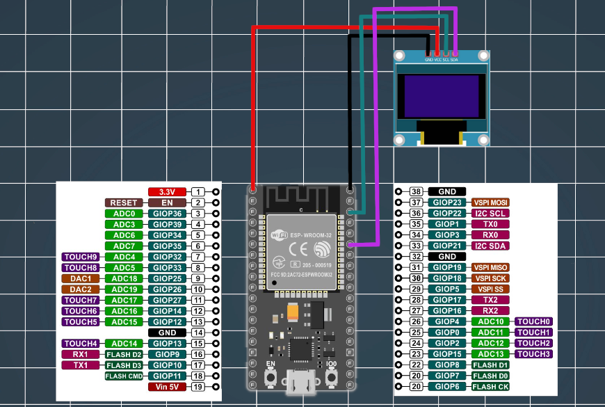
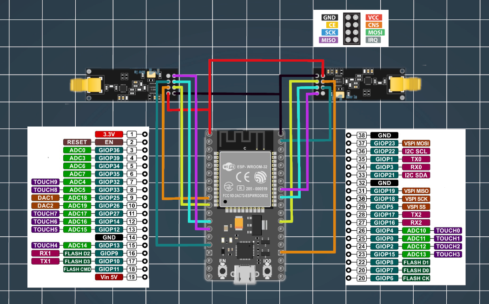

# Cypher Jammer

This project is a modified version of the original code by [dkyazzentwatwa](https://github.com/dkyazzentwatwa/cypher-jammer). All credits for the base functionality go to the original author. Thank you to the original author for their work!

&nbsp;

## Description

This project uses an NRF24L01+ wireless transceiver (with the RadioHead RF24 library), an ESP32 board, and an OLED display to create a jammer-like system that can switch between two radio communication modes: **gradual channel change** and **random channel change**.

&nbsp;

## Features

- **Two Radio Modules**: Uses HSPI and VSPI pins for two separate NRF24L01+ radio modules.
- **Modes**:
  - **Gradual Channel Change**: Channels change gradually in a controlled manner.
  - **Random Channel Change**: Channels are switched randomly to introduce unpredictability.
- **OLED Display**: Shows the current mode (gradual or random) on a 128x64 SSD1306 OLED display.
- **Button Switch**: A physical button is used to toggle between the two modes.
- **Power Saving**: Disables Bluetooth and Wi-Fi to save power when the system is running.

&nbsp;

## Hardware Requirements

- **ESP32 Board**
- **NRF24L01+ Transceivers (x2)**
- **OLED Display (SSD1306, 128x64)**
- **Button for Mode Switching**

&nbsp;

## Software Requirements

- **Arduino IDE**
  - Install the following libraries via the Arduino Library Manager:
    - `RF24` (RadioHead RF24 library)
    - `ezButton` (Debounced button input library)
    - `Adafruit GFX` (Core graphics library)
    - `Adafruit SSD1306` (SSD1306 OLED display driver)

&nbsp;

## Pin Configuration

### HSPI Pins Configuration
- **SCK**: 18
- **MISO**: 19
- **MOSI**: 23
- **CS**: 15
- **CE**: 16

### VSPI Pins Configuration
- **SCK**: 14
- **MISO**: 12
- **MOSI**: 13
- **CS**: 25
- **CE**: 26

### Button Pin
- **GPIO 27** (Button for switching modes)

&nbsp;

## Channel Information

- **nRF24L01 Channel Distribution (2.4 GHz)**:
  - Total Channels: 125 (0-124)
  - Frequency Range: 2400 MHz - 2525 MHz
  - Channel Spacing: 1 MHz
  - Default Usable Range: 0-79 (2400-2479 MHz) to avoid Wi-Fi interference.

- **Wi-Fi (802.11b/g/n) Channels**:
  - Channels 1-14 (Frequency Range: 2412 MHz - 2484 MHz)

- **Bluetooth (2.4 GHz)**:
  - Frequency Range: 2402 MHz - 2480 MHz (79 channels, 1 MHz apart)

&nbsp;

## Mode Switching

- **Gradual Mode**:  
  Increases or decreases the radio channels gradually.
  
- **Random Mode**:  
  Switches the channels randomly, adding unpredictability.

&nbsp;

## Code Overview

### Key Functions

- `gradual_ch()`: Adjusts the radio channels gradually.
- `random_ch()`: Assigns random channels to the radio modules.
- `initSP()`: Initializes the VSPI radio module.
- `initHP()`: Initializes the HSPI radio module.
- `draw_gradual()`: Updates the OLED display to show the "Gradual" mode.
- `draw_random()`: Updates the OLED display to show the "Random" mode.
- `testdrawstyles()`: Demonstrates various text styles on the OLED display.

&nbsp;

### Channel Adjustments
The radio modules are set to channels between 2 and 79. The `gradual_ch()` function increases or decreases the channel value by a fixed amount, while the `random_ch()` function selects a random channel within the allowed range.

&nbsp;

### Power Management
The ESP32 disables Bluetooth and Wi-Fi to reduce power consumption when the jammer is active.

&nbsp;

### Button Debouncing
The `ezButton` library is used to handle button presses with a debounce time of 50ms to prevent multiple triggers from a single press.

&nbsp;

### Debugging
The serial monitor outputs useful information, such as the current mode and channel values, for debugging purposes.

&nbsp;

## Setup

1. **Hardware Setup**:
   - Connect the NRF24L01+ modules to the specified pins on the ESP32.
   - Connect a button to GPIO 27.
   - Connect the OLED display via I2C.

2. **Software Setup**:
   - Open the Arduino IDE.
   - Install the required libraries.
   - Upload the code to your ESP32 board.

3. **Operation**:
   - The system starts in **Gradual Mode**.
   - Press the button to toggle between **Gradual** and **Random** modes.

&nbsp;

## License
This project is a modified version of the code by dkyazzentwatwa. All credits for the base functionality go to the original author.

&nbsp;

## Legal Notice
⚠ **Important**: This project is for **educational purposes only**. Unauthorized signal jamming violates FCC regulations and similar laws in most countries. The maintainers assume no liability for illegal use.

&nbsp;

## Acknowledgements

- Original code by [dkyazzentwatwa](https://github.com/dkyazzentwatwa/cypher-jammer).
- Libraries used:
  - [RF24 (RadioHead RF24)](https://www.airspayce.com/mikem/arduino/RF24/)
  - [ezButton](https://github.com/mik3y/arduino-EZButton)
  - [Adafruit GFX](https://github.com/adafruit/Adafruit-GFX-Library)
  - [Adafruit SSD1306](https://github.com/adafruit/Adafruit_SSD1306)

